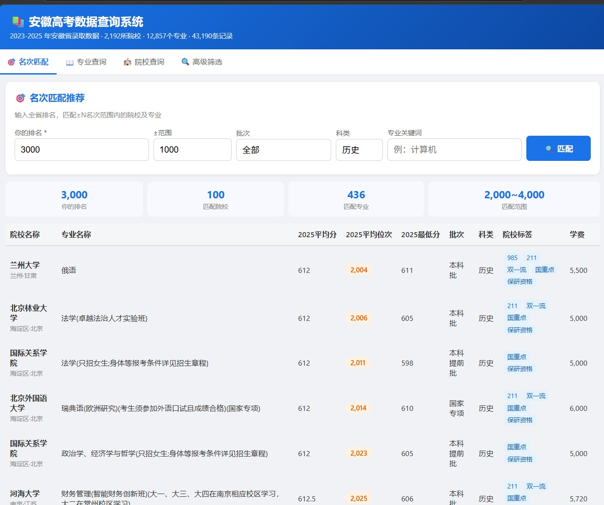
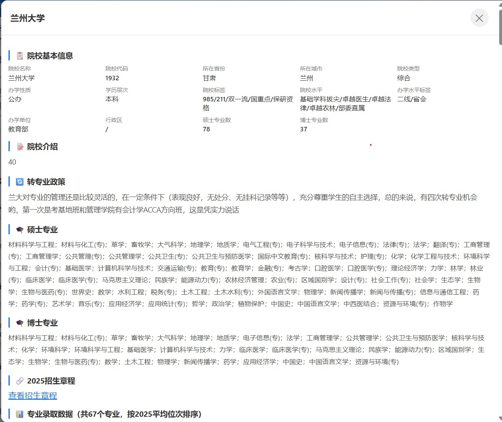
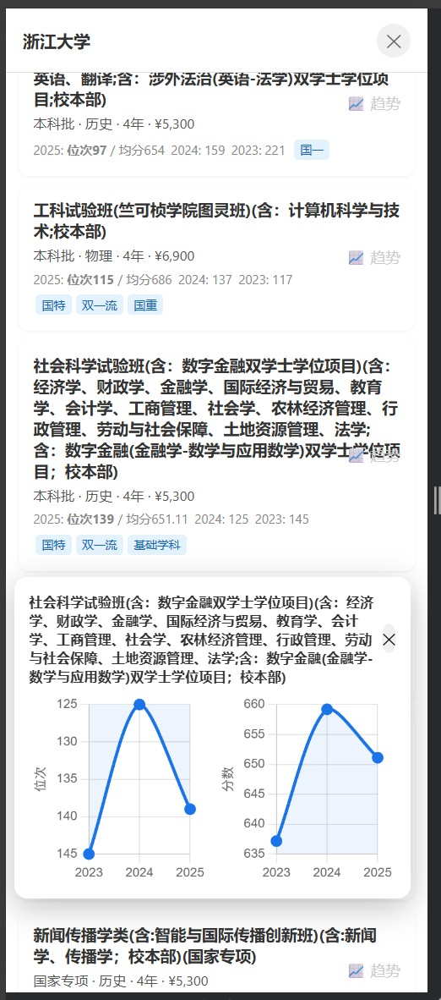

# 🎓 安徽高考数据查询系统

基于 **2023-2025 年安徽省高考录取数据**的智能查询平台，支持名次匹配、专业分析、院校详情和历年趋势对比。

> 🌐 在线地址：[https://zhaofm.cn/](https://zhaofm.cn/)

---

## 📸 效果展示

### 电脑端

|  |  |
|:--:|:--:|
| 名次匹配 + 专业查询 | 院校详情 + 历年趋势 |

### 手机端

<p align="center">
  
</p>

---

## 📊 数据规模

| 项目 | 数量 |
|------|------|
| 院校 | 2,192 所 |
| 专业 | 12,857 个 |
| 录取记录 | 43,190 条 |
| 年份覆盖 | 2023 / 2024 / 2025 |

---

## ✨ 功能一览

| 模块 | 说明 |
|------|------|
| 🎯 **名次匹配** | 输入全省排名，±N 名次范围内自动匹配院校及专业，按位次排序 |
| 📖 **专业查询** | 输入专业名称，查看所有开设该专业的院校历年录取排名 |
| 🏫 **院校查询** | 查看院校介绍、985/211/双一流标签、硕博点、转专业政策、招生章程 |
| 🔍 **高级筛选** | 批次 / 科类 / 省份 / 城市 / 院校类型 / 办学性质 / 院校标签 / 分数范围 / 学费上限 |
| 📈 **趋势图表** | 2023-2024-2025 三年录取位次和分数趋势对比（Chart.js） |
| 📱 **移动端适配** | 卡片式布局、整行点击、44px 触摸目标、全屏弹窗 |

---

## 🚀 快速启动

### Docker（推荐）

```bash
docker compose up -d
```

访问 `http://localhost:5000`

### 本地开发

```bash
pip install flask
python server.py
```

访问 `http://localhost:5000`

### 数据生成

如果需要从原始 Excel 重建数据库：

```bash
python process_data.py   # Excel → JSON
python create_db.py      # JSON → SQLite
```

---

## 📁 项目结构

```
├── server.py                 # Flask API 后端
├── index.html                # 前端单页应用
├── gaokao.db                 # SQLite 数据库（需生成）
├── process_data.py           # 数据预处理（Excel → JSON）
├── create_db.py              # 数据库创建（JSON → SQLite）
├── Dockerfile                # Docker 镜像
├── docker-compose.yml        # Docker 编排
├── requirements.txt          # Python 依赖
├── doc/img/                  # 截图
│   ├── 1.jpg                 # 电脑端 - 匹配查询
│   ├── 20.jpg                # 电脑端 - 院校详情
│   └── 30.jpg                # 手机端 - 移动适配
└── 安徽-2026-专家版数据23-26.xlsx  # 原始数据
```

---

## 🛠 技术栈

- **后端**: Python / Flask / SQLite
- **前端**: Vanilla JS / Chart.js
- **部署**: Docker + Nginx + Let's Encrypt
- **生产服务器**: Waitress
